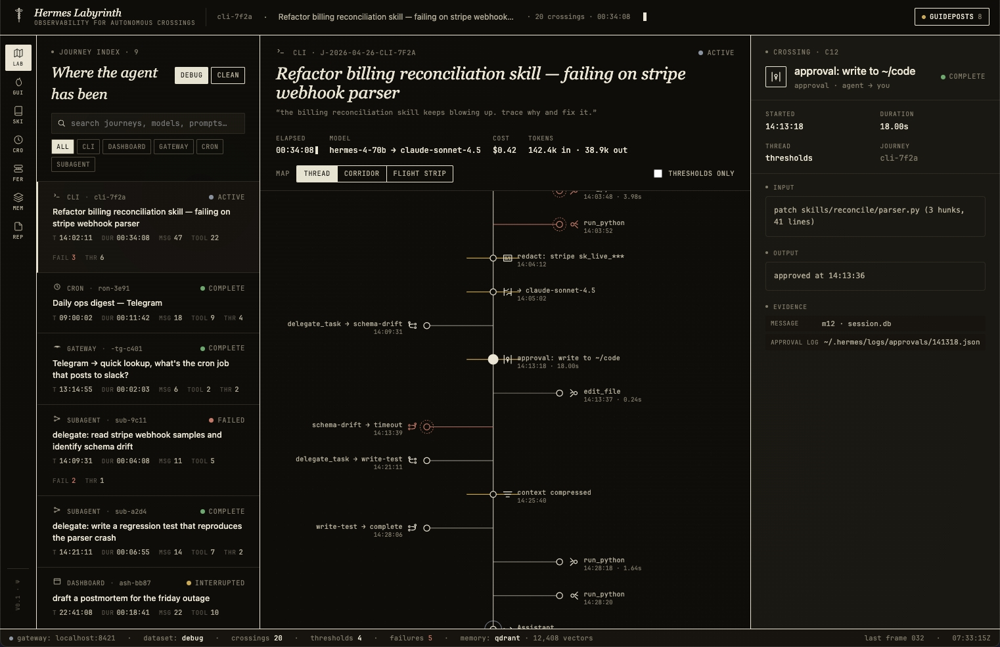

# Hermes Labyrinth

[](https://stainlu.github.io/hermes-labyrinth/)
[](https://github.com/stainlu/hermes-labyrinth/releases)
[](./LICENSE)
[](#verification)
[](https://github.com/NousResearch/hermes-agent)

Read-only observability for [Hermes Agent](https://github.com/NousResearch/hermes-agent).

Hermes Labyrinth turns autonomous work into a map of crossings: prompts, tool
calls, tool results, failures, model switches, subagents, approvals, memory
hits, redactions, context compression, cron runs, and exportable evidence.

It is not a chat UI. It is a black-box recorder for agents moving through
unknown work.



## Demo

- Live demo: https://stainlu.github.io/hermes-labyrinth/
- Current release: [`v0.1.1`](https://github.com/stainlu/hermes-labyrinth/releases/tag/v0.1.1)
- Hermes Agent: https://github.com/NousResearch/hermes-agent

The public demo is static and uses mocked Hermes state so it can run on GitHub
Pages. The installable dashboard plugin reads local Hermes state through Hermes
dashboard plugin routes.

## Highlights

- **Journey index**: recent CLI, dashboard, gateway, cron, and delegated work.
- **Labyrinth map**: ordered crossings through a selected agent journey.
- **Inspector**: input, output, duration, status, evidence, and guideposts for
  a selected crossing.
- **Guideposts**: generated observations backed by local evidence.
- **Skill atlas**: bundled, optional, external, and user skill inventory.
- **Cron gate**: scheduled autonomy, next runs, last failures, and workdirs.
- **Model ferry**: model/provider transitions across sessions.
- **Reports**: redacted Markdown and JSON exports for one journey.

## Install

Install into the Hermes user plugin directory:

```bash
mkdir -p ~/.hermes/plugins
git clone https://github.com/stainlu/hermes-labyrinth.git ~/.hermes/plugins/hermes-labyrinth
```

Start or restart the dashboard:

```bash
hermes dashboard
```

If the dashboard is already running, rescan plugins:

```bash
curl http://127.0.0.1:9119/api/dashboard/plugins/rescan
```

Open the dashboard and select the `Labyrinth` tab.

Optional theme scaffold:

```bash
mkdir -p ~/.hermes/dashboard-themes
cp ~/.hermes/plugins/hermes-labyrinth/theme/hermes-labyrinth.yaml ~/.hermes/dashboard-themes/
```

## Safe Docker PoC

For Docker-based Hermes installs, test Labyrinth against a dedicated Hermes
home first. Do not mount a production profile with live provider, OAuth,
webhook, Discord, Telegram, or deployment tokens until the redaction smoke test
below passes.

Pin a known commit instead of tracking `main` blindly:

```bash
mkdir -p ~/.hermes/plugins
git clone https://github.com/stainlu/hermes-labyrinth.git ~/.hermes/plugins/hermes-labyrinth
cd ~/.hermes/plugins/hermes-labyrinth
git checkout <reviewed-tag-or-commit>
```

Mount the host Hermes home into the dashboard container using the same path the
dashboard expects for user plugins. Keep the dashboard bound to localhost or a
private network while evaluating trace data.

Before production use:

- create a test journey containing dummy API keys, webhook secrets, OAuth
  tokens, and tool outputs
- inspect the Labyrinth UI
- inspect `/reports/<journey_id>.json`
- inspect `/reports/<journey_id>.md`
- confirm dummy secrets are absent from every surface

Rollback is just plugin disable/remove plus a dashboard restart or rescan:

```bash
hermes plugins disable hermes-labyrinth
rm -rf ~/.hermes/plugins/hermes-labyrinth
curl http://127.0.0.1:9119/api/dashboard/plugins/rescan
```

## Data Policy

Hermes Labyrinth is read-only by design.

- It does not start, stop, resume, mutate, or create Hermes sessions.
- Secret redaction is applied to journey summaries, previews, and reports.
- If the Hermes core redactor cannot be loaded or throws, Labyrinth fails
  closed and shows `[redaction unavailable]` instead of raw trace text.
- Unknown fields stay unknown.
- Reports are generated from local Hermes state.
- The public demo uses sample data and should not be treated as live telemetry.

## Verification

```bash
npm test
```

`npm test` runs:

- reproducible build checks for `dashboard/dist` and `index.html`
- frontend JavaScript parse checks
- backend Python parse checks
- API normalization fixture tests, including numeric Hermes timestamps
- packed-artifact and dead-control regressions
- headless Chrome smoke coverage for map modes, route changes, search,
  dataset switching, and the threshold filter

To smoke-test the deployed Pages build:

```bash
npm run smoke:live
```

## Development

```bash
npm run build
npm run check
npm run smoke
```

`dashboard/dist/` is generated from `src/parts/*.js` and `src/labyrinth.css`.
`index.html` is generated from `src/demo/index.html` with content-hash query
strings on the local JS/CSS assets. These files are checked in because Hermes
dashboard plugins and GitHub Pages are loaded directly from built static files.

## Repository Layout

```text
.
├── dashboard/
│   ├── manifest.json        # Hermes dashboard plugin manifest
│   ├── plugin_api.py        # Read-only API over local Hermes state
│   └── dist/                # Generated dashboard plugin bundle
├── docs/
│   ├── CONCEPT.md
│   ├── DESIGN_BRIEF.md
│   └── FUNCTIONAL_SPEC.md
├── scripts/
│   ├── build-plugin.mjs     # Builds dashboard/dist and index.html from src
│   ├── smoke-demo.mjs       # Browser smoke test for the public demo
│   ├── test-plugin-api.py   # Fixture tests for API normalization helpers
│   └── verify.mjs           # Local verification checks
├── src/
│   ├── demo/                # GitHub Pages demo source
│   ├── parts/               # Ordered frontend source chunks
│   └── labyrinth.css        # Frontend CSS source
├── theme/
│   └── hermes-labyrinth.yaml
├── index.html               # Generated GitHub Pages demo
├── screenshot.png           # README screenshot
└── package.json             # Build/check/smoke scripts
```

## Architecture

```text
Hermes local state
  ├─ state.db sessions/messages
  ├─ skills directories
  └─ cron config
        ↓
dashboard/plugin_api.py
        ↓
/api/plugins/hermes-labyrinth/*
        ↓
src/parts/*.js + src/labyrinth.css
        ↓ npm run build
dashboard/dist/*
        ↓
Hermes dashboard tab: Labyrinth
```

## API Surface

```text
GET /api/plugins/hermes-labyrinth/health
GET /api/plugins/hermes-labyrinth/journeys
GET /api/plugins/hermes-labyrinth/journeys/{journey_id}
GET /api/plugins/hermes-labyrinth/journeys/{journey_id}/crossings
GET /api/plugins/hermes-labyrinth/skills
GET /api/plugins/hermes-labyrinth/cron
GET /api/plugins/hermes-labyrinth/guideposts
GET /api/plugins/hermes-labyrinth/reports/{journey_id}.json
GET /api/plugins/hermes-labyrinth/reports/{journey_id}.md
```

## Project Status

`v0.1.1` is a hackathon preview that is stable enough to demo and install as a
read-only dashboard plugin. The public demo and main UI flows are covered by
browser smoke tests; full Hermes dashboard integration tests are still on the
roadmap.

See [Known Limitations](./KNOWN_LIMITATIONS.md), [Roadmap](./ROADMAP.md), and
[Changelog](./CHANGELOG.md).
